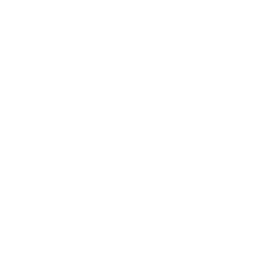

<div style="display: flex; align-items: center;">
  <style>
    .light-mode-icon {
      display: none;
    }
    @media (prefers-color-scheme: dark) {
      .dark-mode-icon {
        display: block;
      }
      .light-mode-icon {
        display: none;
      }
    }
    @media (prefers-color-scheme: light) {
      .dark-mode-icon {
        display: none;
      }
      .light-mode-icon {
        display: block;
      }
    }
  </style>

  
  

  <h1>spore-print-derive</h1>
</div>

`spore-print-derive` provides a custom derive macro for the `SporePrint` trait from the `spore-print` crate.

## Usage

Add this to your `Cargo.toml`:

```toml
[dependencies]
spore-print = "0.1.0"
spore-print-derive = "0.1.0"
```

Example

```rust
use spore_print::{SporePrint, sprint, sprintln};
use std::ops::Range;

/// A struct representing a range of numbers.
struct NumberRange {
    range: Range<usize>,
}

impl SporePrint for NumberRange {
    fn spore_print(&self) -> String {
        self.range.spore_print()
    }
}

fn main() {
    let number_range = NumberRange { range: 3..10 };
    sprint!(number_range); // Prints without a newline
    sprintln!(number_range); // Prints with a newline
}
```

## Features

Derive macro for the SporePrint trait.

## License

This project is licensed under the GPL-3 license.

This example demonstrates how to use the derive macro from the `spore_print_derive` crate to automatically implement the
`SporePrint` trait for a custom type.
